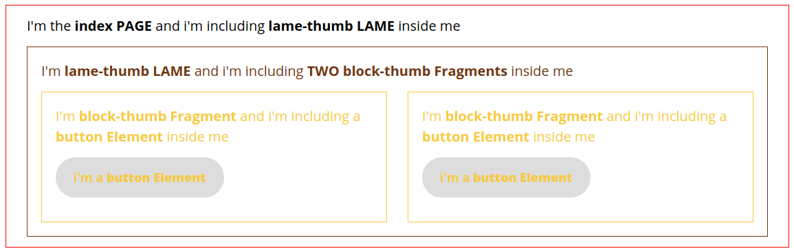

## GULP STARTER WITH GENERATORS AND TRANSLATIONS

A Fleet Management System (FMS)
- AUTOMATICALLY AND EASILLY GENERATE COMPONENTS, BASED ON ATOMIC DESIGN LOGIC: ***Element > Fragment > Lame > Page***.



## Getting Started

These instructions will get you a copy of the project up and running on your local machine for development and testing purposes.


**if you want to edit / create files you should follow instructions below**
### Prerequisites

What things you need to install the software and how to install them.

##### 1 - Install Node JS using the link below:
```
 https://www.npmjs.com/get-npm
```
##### 2 - Install Gulp JS using the link below:
```
https://gulpjs.com/
```


### Installing

A step by step series of examples that tell you have to get a development env running

##### 1 - Clone repository using:

```
git clone  https://git.smile.fr/smile-maroc-montage/GulpStarter.git .
```

##### 2 - Go to directory path:

```
cd YourFolder
```

##### 3 - Install dependencies using:

```
npm install
```

##### 4 - Init Project:
* You have to fill some informations using the commande below:
    * it will give you few questions , you juste have to fill them and ENJOY !

```
gulp init

```

##### 5 - Run / Serve App using:

```
gulp

```

## Generating components *(NEW)*
The new feature added is the ability te generate components via command line

 * gulp ***generate*** **--element** {{ name }}
 * gulp ***generate*** **--fragment** {{ name }}
 * gulp ***generate*** **--lame** {{ name }}
 * gulp ***generate*** **--page** {{ name }}
 * gulp ***generate*** **--layout** {{ name }}
 * gulp ***generate*** **--javascript** {{ name }}

### 1 - Generating JS FILES
```
gulp generate --javascript myJs
```

* This command allows you to create  ***"myJs.ks"*** under ***app/js/fragments*** folder, it automatically creates its content like folowing:


```

/*
 * myJs Functions
 * */

CJS.myJs = {
    init: function () {
        // add your code here
    }
};

```

* ***CJS*** is the namespace used to call scripts, you can replace it on ***app/js/confi.json***.
* It also adds the call on the ***app/js/custom/scripts.js*** like folowing:
* **PS : All generated js files are automatically added to $(document).ready function :**

```
"use strict";

var CJS = CJS || {};

$(document).ready(function () {

    CJS.myJs.init();
    CJS.myJs2.init();
    ...
});

```
### 2 - Generating HTML / SCSS FILES
* Only ***elements***, ***fragments*** and ***lames*** can add SCSS Files ***not pages and layouts***

```
gulp generate --element myElement
gulp generate --fragment myFragment
gulp generate --lame myLame

```

* While executing one of these commands:
    * it generates a ***twig*** file under ***app/views/fragments , elements or lames*** folder (depending on what you generated).
    * it generates a ***scss*** file under ***app/scss/fragments , elements or lames*** folder (depending on what you generated).
    * ***PS: No need to include files to main.scss, they're automatically included while executing these command lines***

```
  gulp generate --page myPage
  gulp generate --layout myLayout

```
* While executing one of these commands:
    * it generates a ***twig*** file under ***app/views/pages , layout*** folder, with ***Twig*** content (depending on what you generated) like folowing:
    * ***PS: NO SCSS file generated***

```



Home


page : Home


```
## Config Files

* There are two ***CONFIG.JSON*** Files to ***NOT TOUCH or EDIT*** :
    * app/scss/config.json : ***This file contains the structure of sass files fragments, lames and elements.***
    * app/js/config.json : ***This file contains the structure of js files fragments.***

## Translations i18n

***(Docs Coming soon)***

## APP Folder Structure

##### 1 - JS FILES
***1.1 - app/js/vendor*** :  Contains all third-Party libraries (Bootstrap, fancybox, animate, etc...) Scripts.

***1.2 - app/js/custom*** :  Contains the Main entry point Scripts.

***1.2 - app/js/fragments*** :  Contains all custom fragments Scripts.

##### 2 - SCSS FILES
***2.1 - app/scss/vendor*** :  Contains all third-Party libraries (Bootstrap, fancybox, animate, etc...) Styles.

***2.2 - app/scss/includes/configs*** :  Contains all config files (varibales, mediaqueries, colors, mixins, fonts , etc...) Styles.

***2.3 - app/scss/includes/elements*** :  Contains all default elements (Inputs, Buttons, Texts, checkboxes, etc ...  default styles) Styles.

***2.4 - app/scss/includes/fragments*** :  Contains all custom fragments Styles.

***2.5 - app/scss/includes/lames*** :  Contains all custom lames Styles.

***2.6 - app/scss/includes/layout*** :  Contains footer, header Styles.


##### 3 - HTML FILES
***3.1 - app/views/fragments*** :  Contains all Custom HTML blocks.

***3.2 - app/views/lames*** :  Contains all Custom HTML lames.

***3.3 - app/views/layout*** :  Contains globl pages layout : skeleton, header & footer .

***3.4 - app/views/pages*** :  Contains all pages where we include our custom blocs.

## DIST Folder Structure
The ***Dist*** Folder contains all compiled files (HTML, CSS, JS) :

***dist/assets*** :  Contains all CSS(*.css & *.min.css), JS(*.js & *.min.js), IMGS, FONTS.

***dist/xxx.html*** : Contains all compiled ***Twig*** files to ***HTML***.

## Built With

* [GulpJS](https://gulpjs.com/) - Workflow Automation :
    * [GULP TWIG](/) - HTML BUILD.
    * [CSS LINTER]() - CSS validator.
    * [AUTOP REFIXER]() - Adding prefixes CSS3 attributes (Enabling CrossBrowser Support).
    * [BROWSER SYNC]() - Auto refresh content while making changes on HTML, CSS, JS files from ***App*** folder.
    * [JS HINT]() - JS Syntax Validator.
* [TWIG](https://gulpjs.com/) - Workflow Automation.
* [Bootstrap 4](https://getbootstrap.com/docs/4.1/getting-started/introduction/) - Toolkit HTML, CSS, JS developpement based on FlexBox.
* [jQuery](https://jquery.com) - Javascript Library.
* [jQuery Valdiate](https://jqueryvalidation.org/) - Javascript Form validate Library.
* [Fancybox 3](https://www.fancyapps.com/fancybox/3/) - JavaScript lightbox library for presenting various types of media.
* [AcimateCSS](https://daneden.github.io/animate.css/) - Animations.
* [OwlCarousel 2](https://owlcarousel2.github.io/OwlCarousel2/) - Carousel sliders.
* [Scroll reveal](https://scrollrevealjs.org/) - Easy scroll animations for web and mobile browsers.

## Authors

* **Tarik HADDADI**  - *FrontEnd Dev* - [TarikHaddadi](https://git.smile.fr/tahad)
* **Mossaab KANZIT** - *FrontEnd Dev* - [MossabKanzit](https://git.smile.fr/mokan)
